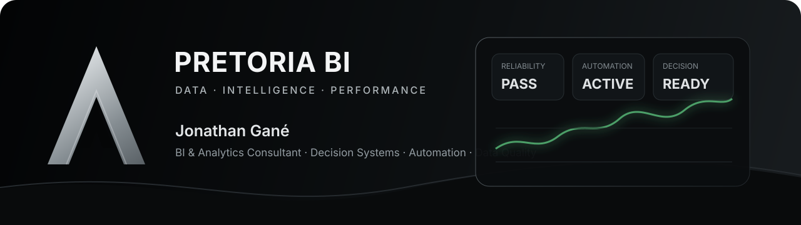

<div align="center">

<a href="https://pretoriabi.com">
  
</a>

<br>

# Jonathan Gané

### Data Analyst · BI & Analytics Consultant
**Founder — Pretoria BI**

## I turn fragmented business data into reliable decision systems.

**Business Intelligence · Data Analytics · Automation · Data Quality · Applied Data Science**

[PRETORIA BI](https://pretoriabi.com) · [LINKEDIN](https://www.linkedin.com/in/jonathan-gan%C3%A9-881a90192/) · [CONTACT](mailto:contact@pretoriabi.com)

`Remote · International` · `Direct collaboration` · `White-label delivery`

</div>

---

## Your company probably does not need more data.

It needs to know:

**What is happening?**  
**Why is it happening?**  
**Where is value being created or lost?**  
**What should happen next?**  
**How will we know whether the decision worked?**

I build the analytical systems behind those answers.

From raw operational data to **trusted KPIs, automated pipelines, decision-ready dashboards, analytical models and measurable actions**.

```text
BUSINESS QUESTION
        ↓
DATA RELIABILITY
        ↓
ANALYTICAL SIGNAL
        ↓
DECISION SYSTEM
        ↓
ACTION
        ↓
MEASURED OUTCOME
```

---

## What I solve

| Business situation | Delivered capability |
|---|---|
| Reporting depends on repetitive Excel work | **Automated reporting pipelines** |
| Management cannot agree on KPI definitions | **Governed metrics & semantic models** |
| Data exists across disconnected systems | **Integrated analytical data models** |
| Dashboards exist but are not trusted | **Data quality, reconciliation & validation** |
| Revenue grows while margin deteriorates | **Profitability & performance analytics** |
| Teams know what happened but not why | **Diagnostic analytics & statistical analysis** |
| Decisions depend heavily on intuition | **Forecasting, scoring & predictive systems** |
| A consultancy needs additional Data capacity | **White-label analytical delivery** |

The technology is selected **after** the decision problem is understood.

---

## How I work

### Understand → Decide → Act → Measure

**Understand** — map the business process, decision, constraints, available data and failure points.  
**Decide** — define the questions, metrics, analytical approach and level of precision actually required.  
**Act** — build the data model, analysis, dashboard, automation or analytical product that fits the use case.  
**Measure** — compare against a baseline and determine whether the intervention changed the intended outcome.

A Data project does not start with a tool. It starts with a **decision worth improving**.

---

## Proof standard

My public work follows one rule:

> **A claim in a README must be verifiable inside the repository.**

If a project says **tested**, there are tests.  
If it says **reconciled**, distinct states are actually compared.  
If it says **predictive**, there is a baseline and out-of-sample evaluation.  
If it says **reproducible**, another person can replay the workflow from documented instructions.  
If it says **business impact**, the calculation and assumptions must be inspectable.

Each substantial project is designed around six layers of evidence:

| Layer | Question |
|---|---|
| **Business Proof** | Is the problem worth solving and tied to a real decision? |
| **Data Proof** | Are grain, contracts, quality and reconciliation explicit? |
| **Analytical Proof** | Do the data and method support the conclusion? |
| **Engineering Proof** | Is the implementation tested, readable and reproducible? |
| **Operational Proof** | Does it fail closed, recover and run under CI? |
| **Value Proof** | Is the action or opportunity measurable without inventing realised ROI? |

---

## Flagship decision-system case study

### [Hospitality Intelligence Platform](https://github.com/Jericho107/hospitality-intelligence-platform)

A synthetic multi-property decision system built around one management question:

> **Revenue is growing. Why is controllable operating contribution deteriorating — and where should management act first?**

The repository connects PMS, POS, procurement, inventory, labour and budget into a governed analytical system with:

- PostgreSQL raw landing and dimensional modelling;
- source → raw → fact → KPI reconciliation and deliberate failure injection;
- governed hospitality KPI contracts;
- TMDL semantic model and DAX measures;
- four PBIR decision pages and 20 source-controlled visual containers;
- Microsoft PBIR conformance validation in CI;
- healthy-vs-leakage diagnostic controls;
- baseline-first seven-day demand forecasting with weak-model rejection;
- auditable management-opportunity modelling with explicit assumptions and sensitivity.

`Hospitality` · `PostgreSQL` · `Python` · `SQL` · `Power BI` · `TMDL` · `PBIR` · `DAX` · `Forecasting` · `Data Quality` · `CI`

**Evidence boundary:** the source-controlled Power BI project passes Microsoft's PBIR validator, but the repository does not yet claim successful Power BI Desktop rendering. A local Desktop Bridge evidence gate is already implemented for that final runtime proof.

[Explore the flagship →](https://github.com/Jericho107/hospitality-intelligence-platform)

---

## Validated public case study

### [Banking DataOps Monitoring](https://github.com/Jericho107/banking-dataops-monitoring)

Synthetic regulated-data control system designed to prove whether a PostgreSQL analytical target still matches its source after ingestion.

**Validated evidence includes:**

- independent CSV source and PostgreSQL target states;
- SQL-backed data-quality controls;
- transaction-level source-to-target reconciliation;
- missing, unexpected, duplicate and amount-mismatch detection;
- fail-closed CLI behavior;
- Streamlit monitoring;
- Docker Compose;
- pytest and Ruff;
- GitHub Actions CI;
- incident, recovery and proof documentation.

`PostgreSQL` · `Python` · `SQL` · `Data Quality` · `Reconciliation` · `Streamlit` · `Docker` · `CI`

The repository has passed its reverse test on GitHub Actions: a clean state reconciles, a deliberate target mutation is detected as a failure, and source reload restores a passing state.

[View the repository →](https://github.com/Jericho107/banking-dataops-monitoring)

---

## Behavioral analytics case study

### [Speed Dating Behavioral Analytics](https://github.com/Jericho107/Projet-social-engineering-on-Tinder)

A public behavioral-data case study used to demonstrate the boundary between descriptive analysis, statistical association and predictive modelling.

**Current governed evidence includes:**

- explicit target/post-outcome leakage controls;
- fail-closed feature auditing;
- binary-target and probability contracts;
- statistical-analysis and effect-size workflow;
- realistic-versus-leaky model framing;
- explainability boundary;
- Streamlit runtime path correction;
- pytest + Ruff + GitHub Actions;
- CI reverse test that deliberately injects target leakage.

`Python` · `Statistics` · `scikit-learn` · `XGBoost` · `SHAP` · `Streamlit` · `CI`

The project does not treat association or SHAP importance as causal evidence.

[View the repository →](https://github.com/Jericho107/Projet-social-engineering-on-Tinder)

---

## Pretoria BI — complementary decision systems

The portfolio now includes six additional executable repositories, each designed around a distinct failure mode or management decision:

| Repository | Decision / proof focus |
|---|---|
| [Accounting Firm Intelligence](https://github.com/Jericho107/accounting-firm-intelligence) | profitability, WIP, receivables and deadline risk |
| [Executive BI Command Center](https://github.com/Jericho107/Executive-bi-command-center) | KPI variance, cash conversion, retention and priority |
| [Automated Data Reporting Pipeline](https://github.com/Jericho107/Automated-data-reporting-pipeline) | schema contracts, deterministic reconciliation and reporting automation |
| [Customer Growth Experimentation](https://github.com/Jericho107/Customer-growth-experimentation) | A/B testing, SRM, significance, practical effect and guardrails |
| [Data Quality Rescue](https://github.com/Jericho107/Data-quality-rescue) | fail-closed quality controls, defect detection and recovery |
| [Predictive Business Analytics](https://github.com/Jericho107/Predictive-business-analytics) | baseline-first prediction, leakage prevention and model acceptance |

Each repository includes an executable core, tests, GitHub Actions and a deliberate reverse-test. They are complementary case studies; **Hospitality remains the deepest flagship architecture** until these repositories accumulate equivalent end-to-end evidence.

---

## Portfolio evidence hierarchy

The live repositories are intentionally differentiated rather than padded with copies of the same pattern:

| Repository | Primary proof |
|---|---|
| **Hospitality Intelligence Platform** | end-to-end business decision system: source contracts → PostgreSQL → governed KPIs → diagnostics → forecasting → Power BI source model → value model |
| **Banking DataOps Monitoring** | full-row source-to-target integrity, operational controls, corruption detection and recovery |
| **Speed Dating Behavioral Analytics** | statistical reasoning, leakage-aware modelling, explainability and interpretation boundaries |

A repository is not promoted as flagship evidence merely because it has many files. It must demonstrate distinct business value, executable controls and a falsifiable central claim.

See [PORTFOLIO_STANDARD.md](PORTFOLIO_STANDARD.md) for the quality gate applied across public work.

---

## Technical ecosystem

### Business Intelligence
`Power BI` · `DAX` · `Power Query` · `Tableau` · `Excel` · `Dimensional Modelling`

### Analytics
`Python` · `Pandas` · `NumPy` · `SciPy` · `Statsmodels` · `EDA` · `Statistical Testing`

### Data & Analytics Engineering
`SQL` · `PostgreSQL` · `ETL / ELT` · `APIs` · `Data Modelling` · `Data Quality`

### Applied Data Science
`Scikit-learn` · `XGBoost` · `Feature Engineering` · `Cross-validation` · `SHAP`

### Delivery & Engineering
`FastAPI` · `Streamlit` · `Docker` · `Git` · `GitHub Actions` · `pytest` · `Ruff`

The objective is not to maximise the number of tools used.

It is to build the **simplest architecture that reliably solves the business problem**.

---

## Business background

Before specialising in Data Analytics, Business Intelligence and Data Science, I spent nearly **nine years in Food & Beverage management**, including high-end hotels and fine-dining environments across four continents.

That operational background means I encountered business problems before encountering them as datasets:

**margins · purchasing · inventory · staffing · occupancy · customer retention · service quality · operational performance**

It shapes the way I approach analytics today:

> **Understand how the activity actually works, then turn its data into useful signals, testable hypotheses and measurable levers for action.**

---

## Pretoria BI

**Pretoria BI** is my independent Data & Business Intelligence consultancy.

Its work is structured around:

`Data Audit` · `Consulting` · `Business Intelligence` · `Data Analytics` · `Automation` · `Data Science`

I work directly with companies and can also integrate into the delivery of consultancies, agencies, ESNs and independent experts through confidential **white-label collaboration**.

**Make the data reliable. Clarify the decision. Trigger action. Measure the result.**

---

## Let's talk about the problem, not the stack.

If your organisation spends too much time producing reports, has data but limited visibility, cannot fully trust its KPIs, needs stronger analytical capacity or wants to automate a recurring data workflow, the relevant conversation starts with the **decision you want to make better**.

<div align="center">

### [Explore Pretoria BI](https://pretoriabi.com) · [Discuss a project](mailto:contact@pretoriabi.com) · [Connect on LinkedIn](https://www.linkedin.com/in/jonathan-gan%C3%A9-881a90192/)

**Jonathan Gané — Pretoria BI**  
**DATA · INTELLIGENCE · PERFORMANCE**

</div>
